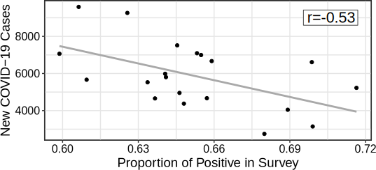
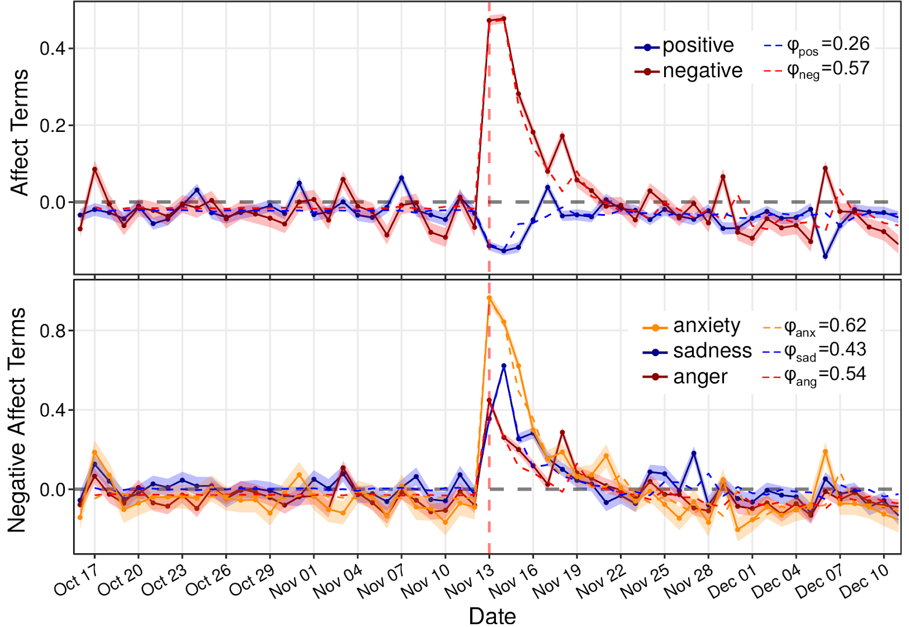
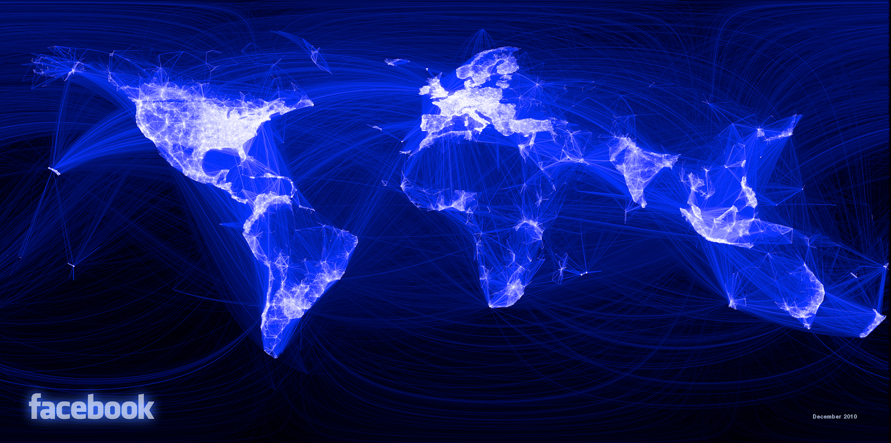
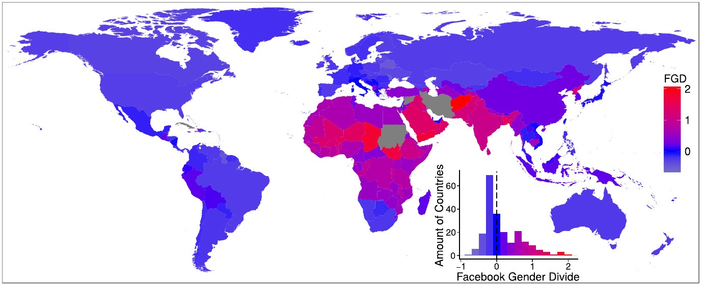
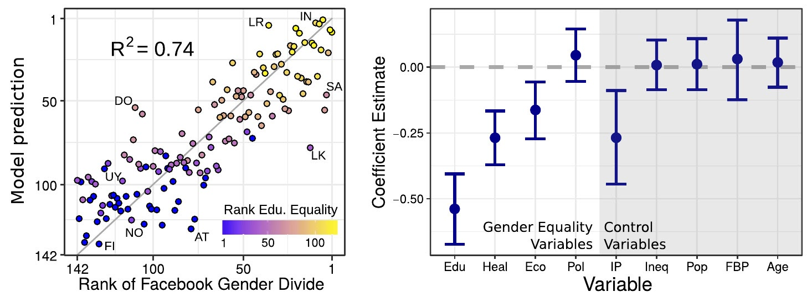

```{r xaringan-themer, include=FALSE, warning=FALSE}
#This block contains the theme configuration for the CSS lab slides style
library(xaringanthemer)
library(showtext)
style_mono_accent(
  base_color = "#5c5c5c",
  text_font_size = "1.5rem",
  header_font_google = google_font("Arial"),
  text_font_google   = google_font("Arial", "300", "300i"),
  code_font_google   = google_font("Fira Mono")
)
```

```{r setup, include=FALSE}
options(htmltools.dir.version = FALSE)
```


layout: true
<div class="my-footer"><span>David Garcia - Computational Social Science Lab - TU Graz + CSH Vienna</span></div> 

---
class:center
# About me

.pull-left[
```{r, echo=FALSE, out.width=270}
knitr::include_graphics("figures/Profile.jpg")
```
]

.pull-right[
<br>
Website: [dgarcia.eu](https://dgarcia.eu)

Twitter: [@dgarcia_eu](https://twitter.com/dgarcia_eu)

Github: [dgarcia-eu](https://github.com/dgarcia-eu)

Email: dgarcia@tugraz.at
]

Professor for Computational Behavioral and Social Sciences at TU Graz
<br>Faculty member of the Complexity Science Hub Vienna
<br>Group leader at the Medical University of Vienna

---

background-image: url(figures/AboutUS.svg)
background-size: 98%

---

# Overview

</br>
##1. Introduction to Computational Social Science

##2. Computational Social Science of Emotions

  ### 2.1: Validating Social Media Macroscopes of Emotions
  ### 2.2: Collective Emotions after a Terrorist Attack
##3. Analyzing Online Gender Inequality

---

<center>
```{r, echo=FALSE, out.width=900}

```
### Aim: understanding human behavior and socio-technical phenomena in the digital society

---

## *Computational* in Computational Social Science
It can have three meanings:

- **Digital**<br> 
Based on large datasets of human behavior, for example produced by the Web and social media

- **Computerized**<br>
The quantitative analysis of data in an automated, tractable, repeatable, and extensible fashion

- **Generative**<br>
Application of data and results to design of agent-based models that explain complex social phenomena and motivate interventions

---

## The Hype Cycle of Computational Social Science
<center>
```{r, echo=FALSE, out.width=900}
knitr::include_graphics("figures/Hype1.svg")
```

---
## The Hype Cycle of Computational Social Science
<center>
```{r, echo=FALSE, out.width=900}
knitr::include_graphics("figures/Hype3.svg")
```


---

# Avoid making a data piñata

```{r, echo=FALSE, out.width=1050}
knitr::include_graphics("figures/pinata.png")
```

---

## Strengths and weaknesses of digital trace data

**Strengths:**
- Complementary approach to traditional survey and experimental methods
- Unprecedented scales and granularities
- Ease of data access, replicability of results
- Potentially high external validity, behavior in vivo

**Weaknesses:**
- Limits to internal validity: Lack of counterfactuals hinders causal analysis
- Self-selection bias: Who talks? Normalization issues: Who is silent?
- Data gatekeepers, Twitter as a model organism
- Intractability of black-box predictions and data piñatas

<div style="font-size:15pt">
Bit By Bit: Social Research in the Digital Age. M. Salganik (2017)
</div>

<div style="font-size:15pt">
Meaningful measures of human society in the twenty-first century. D. Lazer et al. (2021)
</div>
---

background-image: url(figures/VennV2-1.svg)
background-size: 97%
---
background-image: url(figures/VennV2.svg)
background-size: 97%
---


# Overview

</br>
##1. Introduction to Computational Social Science

##*2. Computational Social Science of Emotions*
  
  ### *2.1: Validating Social Media Macroscopes of Emotions*
  ### 2.2: Collective Emotions after a Terrorist Attack

##3. Analyzing Online Gender Inequality

---

# Computational Affective Science

**Computational Affective Science:** Combining big social data and computational modeling to understand affective life and emotional well-being
<center>
Vienna Research Group in Complexity Science funded by the 
<br>
Viena Science and Technology Fund  (1.6M Euro)  
```{r, echo=FALSE, out.width=700}
knitr::include_graphics("figures/VRG.png")
```

---

layout: true
<div class="my-footer"><span>
<a href=https://arxiv.org/abs/2107.13236> Social media emotion macroscopes reflect emotional experiences in society at large. David Garcia, Max Pellert, Jana Lasser, Hannah Metzler. https://arxiv.org/abs/2107.13236 (2021)</a></span></div>


---

```{r, echo=FALSE, out.width=950, fig.align='center'}
knitr::include_graphics("figures/earth.svg")
```

---

# Social Media Macroscopes of Emotions

.pull-left[
```{r, echo=FALSE, out.width=1100}
knitr::include_graphics("figures/Macy.jpg")
```
<font size="5">
<a href="https://science.sciencemag.org/content/333/6051/1878/"> Diurnal and seasonal mood vary with work, sleep, and daylength across diverse cultures. Golder & Macy, Science (2011) </a>
</font>
]

.pull-right[
```{r, echo=FALSE, out.width=1100}
knitr::include_graphics("figures/hedonometer.png")
```

<font size="5">
<a href="https://journals.plos.org/plosone/article?id=10.1371/journal.pone.0026752"> Temporal patterns of happiness and information in a global social network: Hedonometrics and Twitter. Dodds et al. PLoS One (2011) </a>
</font>
]

---


## Basics: Linguistic Signals in Text

**Linguistic Inquiry and Word Count, LIWC (pronounced “Luke”)**  
- Simple word matching method  
- Generated and validated by psychologists (Pennebaker et al., 2001-2015)
- Multiple classes, calibrated for netspeak and neologisms


.pull-left[
```{r, echo=FALSE, out.width=1000}
knitr::include_graphics("figures/LIWC.png")
```
]
.pull-right[
**Examples of LIWC classes:**  
Positive Affect, Negative Affect  
Anxiety, Sadness, Anger  
Social processes  
Prosocial terms (Frimer, et. al, 2014)  
French values (libert\*, egalit\*, fraternit\*)
]


---

## Basics: Some univariate statistics notation


- $X$ is a random variable
  - In data: $X_i$ is the value of the variable for entry $i$
  - For example the GDP of a country

- $E[X]$ is the expected value of $X$
  - We estimate the expected value as the mean of $X$: 
  $$\mu_X = \frac{1}{N}\sum_i X_i$$
  - $N$ is the number of data points, for example the number of countries

---


## Basics: Pearson's Correlation Coefficient $r(X,Y)$

> **Correlation:** Linear association or dependence between the values of variables $X$ and $Y$
 
- If $X$ and $Y$ are independent, they satisfy that the expectation of the product equals the product of expectations:  
$$E[XY] = E[X]E[Y]$$  
- The principle: correlation as the deviation from $E[XY] − E [X]E[Y] = 0$  
- The absolute value of this difference can be at most $\sigma_X\sigma_Y$ (std. devs)
- $r(X,Y)$ rescales the difference to be between −1 and 1  

$$r(X,Y) = \frac{E[XY] − E [X]E[Y]}{\sigma_X\sigma_Y}$$
---
## Basics: Anscombe's quartet  ( $r=0.816$ )

.center[]
---
## Basics: The Datasaurus dozen
.center[]

---

## Limits of Social Media Data to Study Emotion

```{r, echo=FALSE, out.width=1100}
knitr::include_graphics("figures/Jaidka.png")
```

[Estimating geographic subjective well-being from Twitter: A comparison of dictionary and data-driven language methods. Jaidka et al. PNAS (2020)](https://www.pnas.org/content/117/19/10165.short)

---

# Validating a UK emotion macroscope

```{r, echo=FALSE, out.width=975, fig.align='center'}

```

---


# Validating a UK emotion macroscope
1. Two years of weekly representative UK emotion survey by YouGov
2. UK Twitter data for the same period: 1.5 Billion tweets (without RT)
3. Text analysis: dictionary-based (LIWC) and supervised (RoBERTa)
4. Gender detection of twitter users based on profile
5. Gender-rescaled time series of emotional expression

```{r, echo=FALSE, out.width=900, fig.align='center'}
knitr::include_graphics("figures/Data.svg")
```

---

# Sadness in Twitter and YouGov

```{r, echo=FALSE, out.width=1200, fig.align='center'}
knitr::include_graphics("figures/Sadness.svg")
```

- Similar results with dictionary-based and supervised (r~0.65)
---

# Anxiety in Twitter and YouGov

```{r, echo=FALSE, out.width=1200, fig.align='center'}
knitr::include_graphics("figures/Anxiety.svg")
```

- Better results with dictionary-based method and with gender rescaling
- Results robust to autocorrelation and heteroskedasticity

---

# Joy in Twitter and YouGov

```{r, echo=FALSE, out.width=1200, fig.align='center'}
knitr::include_graphics("figures/Joy.svg")
```

- Substantially better results with supervised method than dictionary-based
---

# Exploring 12 emotional states
.pull-left[

- Time series of number sentences like "I am [emotion]" on Twitter

- Weak correlations happen for infrequent emotions in text

- Comparison: US weekly pre-election polls correlate with 0.66

- Arxiv preprint at https://arxiv.org/abs/2107.13236

]

.pull-right[
```{r, echo=FALSE, out.width=700}
knitr::include_graphics("figures/Figure2.svg")
```
]

---

layout: true
<div class="my-footer"><span>
Validating daily social media macroscopes of emotions. Max Pellert, Hannah Metzler, Michael Matzenberger, David Garcia. Working Paper (2021)</span></div>

---

## Study 2: Validating an Austrian macroscope

.pull-left[

- 20-day emotion survey in derstandard.at (N=268,128)
- Daily frequency, 3-day windows

- Text from Der Standard forum (N=452,013)

- Austrian tweets (N=515,187) filtered as UK macroscope

- Compared dictionary-based (LIWC) and supervised model (GS)

]
.pull-right[
```{r, echo=FALSE, out.width=800}
knitr::include_graphics("figures/DS1.svg")
```
]

---

## Twitter sentiment and Der Standard survey

```{r, echo=FALSE, out.width=1000, fig.align='center'}
knitr::include_graphics("figures/DS2.svg")
```

---

# Correlations with new COVID-19 cases

.pull-left[
```{r, echo=FALSE, out.width=600}

```
]
.pull-right[
```{r, echo=FALSE, out.width=600}
knitr::include_graphics("figures/DS32.svg")
```
]

- Do correlations attenuate due to additional social media measurement error?
- Survey emotion correlation with new cases as strong as Twitter sentiment
- Errors sources might be different: Need for conceptual validations

---

layout: true
<div class="my-footer"><span>
<a href=https://arxiv.org/abs/2107.13236> Social media emotion macroscopes reflect emotional experiences in society at large. David Garcia, Max Pellert, Jana Lasser, Hannah Metzler. https://arxiv.org/abs/2107.13236 (2021)</a></span></div>

---


# Overview

</br>
##1. Introduction to Computational Social Science

##*2. Computational Social Science of Emotions*
  
  ### 2.1: Validating Social Media Macroscopes of Emotions
  ### *2.2: Collective Emotions after a Terrorist Attack*

##3. Analyzing Online Gender Inequality

---


layout: true
<div class="my-footer"><span>
<a href=https://doi.org/10.1177%2F0956797619831964> Collective Emotions and Social Resilience in the Digital Traces After a Terrorist Attack. David Garcia Bernard Rimé. Psychological Science (2019)</a></span></div> 

---

## The Social Function of Collective Emotions

<center>
```{r, echo=FALSE, out.width=900}
knitr::include_graphics("figures/ColectiveEmotions.png")
```
</center>

- **Theory of collective effervescence** (Durkheim, 1912):
Shared emotions generate social identity, reinforce shared beliefs, and lead to higher solidarity

- **Collective emotions** (von Scheve and Salmela, 2014):   
Emotional states shared by a large amount of people at the same time


---

background-size: 40%
background-image: url(figures/Trauma.png)
background-position: 90% 60%


## Emotional Responses to Collective Traumas

**How do societies respond to traumatic events?**  
**Is there a social function of collective emotions?**
.pull-left[
- Emotional synchronization: Experience of simultaneous negative emotions

- Collective emotion lasts longer than individual emotional reactions

- Individuals that participate in the collective emotions show higher levels of long-term solidarity ]

---


## Twitter Digital Traces after a Terrorist Attack

Focus on Paris Attacks of of Nov 13, 2015  
Removed bots, news media, and organizations. Final sample of 62,114 users  
Retrieved historical timeline of users. Total of more than 27 Million tweets (no RT)
<center>
```{r, echo=FALSE, out.width=900}
knitr::include_graphics("figures/ParisCase.png")
```

---


## Evidence of Collective Emotions
<center>
```{r, echo=FALSE, out.width=750}

```
</center>

---

### Collective Dynamics of Social Resilience Indicators
<center>
```{r, echo=FALSE, out.width=720}
knitr::include_graphics("figures/TS2.png")
```
</center>


---

## Emotional Synchronization Effect

.pull-left[
<center>
```{r, echo=FALSE, out.width=470}
knitr::include_graphics("figures/TS3.png")
```
</center>
]

.pull-right[
Division of users into two groups based on their emotional expression two weeks after the attacks

Frequency of social process terms:
- Very similar before the attacks
- Strong difference after the attacks
- Difference lasts for months

Similar effect for prosocial terms and shared values terms
]


---

# Overview

</br>
##1. Introduction to Computational Social Science

##2. Computational Social Science of Emotions

##*3. Analyzing Online Gender Inequality*


---
class:center

# How can social media affect our society?

.pull-left[
Opportunities and benefits

```{r, echo=FALSE, out.width=950}

```
]
--
.pull-right[
Risks and problems

```{r, echo=FALSE, out.width=950}

```
]
---

layout: true
<div class="my-footer"><span>
<a href=http://www.pnas.org/content/early/2018/06/12/1717781115> Analyzing gender inequality through large-scale Facebook advertising data. David Garcia et al. Proceedings of the National Academy of Sciences (2018)</a></span></div>

---


# Inequality and gender in social media

- The Internet as the Great Potential Equalizer (Hargittai & Hsieh 2013): 
  - Providing opportunities and  information access to everyone?

- "Unequal distribution of Internet access might exacerbate socioeconomic inequalities."
<div style="text-align: right"> <em property="italic"> World Bank: World Development Report 2016: Digital Dividends </em></div>

- "One in five female Internet users live in countries where harassment and abuse of women online is extremely unlikely to be punished." 
<div style="text-align: right"> <em property="italic"> The Web and Rising Global Inequality.  World Wide Web Foundation, 2015 </em></div>

---

## The Facebook Ads API in demographics

```{r, echo=FALSE, out.width=800, fig.align='center'}
knitr::include_graphics("figures/FBAPI.png")
```
- Programmatic Interface to automate marketing campaign in Facebook
- Audiences can be tuned by demographic attributes (gender, age, income...) or interests (sports, political parties, entertainment...) 
- Accessible for everyone with a Facebook account - audience metrics for everyone
- Used in demographics and development research (e.g. [Zagheni, Weber, & Gummadi, 2017;](https://doi.org/10.1111/padr.12102) [Mejova et al., 2018;](https://dl.acm.org/doi/abs/10.1145/3209811.3212698) [Fatehkia, Kashyap, & Weber, 2018](https://www.sciencedirect.com/science/article/pii/S0305750X18300883))
- Python package to use it: https://github.com/maraujo/pySocialWatcher

---

## The Facebook Gender Divide 

$R_{g,c}$: Ratio of Facebook active users of gender *g* over all inhabitants of gender *g* in country *c*

<center>

Facebook Gender Divide for country c:  
<br>$$FGD_c= log\left(\frac{R_{Male,c}}{R_{Female_c}}\right)$$</center>

Validation with survey data:
- FGD (217 countries)
- Global Web Index (34 countries)
- Pew Internet research (19 countries)

---

# Validation against international surveys

.pull-left[
```{r, echo=FALSE, out.width=500, fig.align='center'}
knitr::include_graphics("figures/FGDval1.png")
```
]

.pull-right[
```{r, echo=FALSE, out.width=550, fig.align='center'}

```
]


---
## The Facebook Gender Divide across countries

```{r, echo=FALSE, out.width=1100, fig.align='center'}

```

---
# Basics: Linear Regression

Regression models formalize an equation in which one numeric variable $Y$ is formulated as a linear function of other variables $X_1$, $X_2$, $X_3$, etc: <center>
$Y = a + b_1 X_1 + b_2 X_2 + b_3 X_3 ... + \epsilon$
</center>
- $Y$ is called the dependent variable

- $X_1$, $X_2$, $X_3$, etc are called independent variables

- $a$ is the intercept, which measures the expected value of $Y$ that does not depend on the dependent variables

- $b_1$, $b_2$, $b_3$, etc are called the slopes or the coefficients

- $\epsilon$ are the residuals, the errors of the equation in the data


---

## The FGD and offline gender inequality

```{r, echo=FALSE, out.width=1100, fig.align='center'}

```
- Regression of FGD rank on WEF gender indices and controls
- Most explanatory variable: Education Gender Equality
---


layout: true
<div class="my-footer"><span>David Garcia - Computational Social Science Lab - TU Graz + CSH Vienna</span></div> 

---
# Summary

- Computational Social Science
  - Opportunities and challenges in using digital trace data to study humans
- Computational affective science
  - [**Social media emotion macroscopes reflect emotional experiences in society at large.** David Garcia, Max Pellert, Jana Lasser, Hannah Metzler. Arxiv preprint (2021)](https://arxiv.org/abs/2107.13236)
  - [**Collective Emotions and Social Resilience in the Digital Traces After a Terrorist Attack.** David Garcia, Bernard Rimé. Psychological Science (2019)](https://journals.sagepub.com/doi/full/10.1177/0956797619831964)
- Tracking gender inequality with Facebook data
  - [**Analyzing gender inequality through large-scale Facebook advertising data.** David Garcia et al. Proceedings of the National Academy of Sciences (2018)](http://www.pnas.org/content/early/2018/06/12/1717781115)


---


## TU Graz Master in Computational Social Systems

```{r, echo=FALSE, out.width=750, fig.align='center'}
knitr::include_graphics("figures/CD-MKT-StudMa-Kampagne-CSS-Flyer-A5-an02.png")
```


**More at: [tugraz.at/go/master-css](https://tugraz.at/go/master-css),  [dgarcia.eu](https://dgarcia.eu), and Twitter: [@dgarcia_eu](https://twitter.com/dgarcia_eu)**
